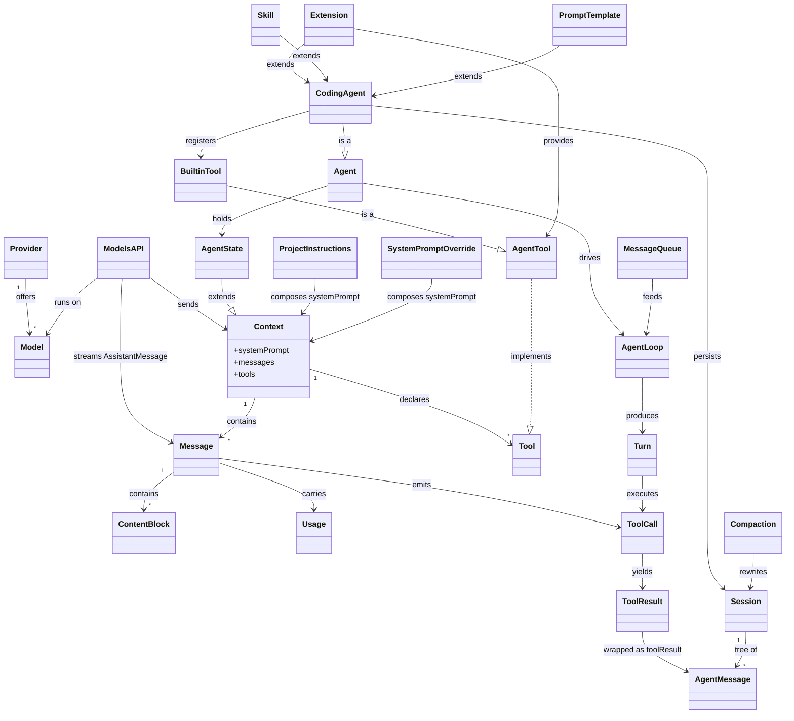

# Pi Coding Agent — Shared Domain Model

`pique` is built **on top of pi** — the open-source coding-agent harness
[`earendil-works/pi`](https://github.com/earendil-works/pi) (aka `badlogic/pi-mono`).
pi keeps a deliberately small core (a provider-neutral LLM API, an agent loop, and
four file/shell tools) and lets everything else be extended at runtime.

This document is our **shared domain model**: a ubiquitous-language glossary of pi's
core entities and how they relate. The goal is that everyone building on pique refers
to the same concepts by the **same names pi itself uses** (shown in `code font`),
rather than inventing parallel abstractions. Scope is **entities** — the nouns of the
system — not the full streaming/event lifecycle.

The model is organized into four layers that mirror pi's package boundaries. Each
layer builds on the one above it.

---

## Layer 1 — AI / Model (`@earendil-works/pi-ai`)

The provider-neutral LLM substrate. Everything here is serializable data with no agent
behavior — it describes *what to send to a model* and *what comes back*.

| Entity | pi name | Definition |
| --- | --- | --- |
| **Provider** | `Provider` | An LLM service (Anthropic, OpenAI, Google, …). Owns a model catalog, authentication, and streaming behavior. |
| **Model** | `Model<Api>` | A single language model, with metadata: id, name, API type, context-window size, and capabilities. |
| **Context** | `Context` | Serializable conversation state — `systemPrompt`, `messages`, and optional `tools`. The unit handed to a model for a request. |
| **Message** | `UserMessage` / `AssistantMessage` / tool-result | A conversation turn, as a discriminated union on `role`. |
| **Content block** | `TextContent`, `ImageContent`, `ToolCall`, `ThinkingContent` | The typed parts that make up a message body. |
| **Tool** | `Tool` | A callable definition with a TypeBox parameter schema. Declares a capability; does not execute it. |
| **Usage** | `usage` | Token/cost accounting carried on an `AssistantMessage`: `{ input, output, cost }`. |
| **Models API** | `Models` | The entry point. Exposes `stream()` / `complete()` (plus `*Simple` reasoning variants) over `(model, context, opts)`. |

---

## Layer 2 — Agent Runtime (`@earendil-works/pi-agent`)

Turns a Context plus Tools into an autonomous loop that actually *executes* tool calls
and feeds results back to the model.

| Entity | pi name | Definition |
| --- | --- | --- |
| **Agent** | `Agent` | The stateful runtime: drives tool execution and emits an event stream. |
| **Agent Loop** | `agentLoop()` / `agentLoopContinue()` | Low-level iterator driving perceive → decide → act. `agentLoopContinue()` resumes from an existing context. |
| **Agent State / Context** | `AgentState`, `AgentContext` | Working state: `systemPrompt`, `model`, `thinkingLevel`, `tools`, `messages`, plus read-only streaming fields (`isStreaming`, `pendingToolCalls`, …). |
| **Agent Message** | `AgentMessage` | `user` \| `assistant` \| `toolResult`; extensible via `CustomAgentMessages` declaration merging. |
| **Agent Tool** | `AgentTool` | A `Tool` plus an async `execute()` — name, description, params, and behavior. This is a Tool made runnable. |
| **Tool Call → Tool Result** | `ToolCall` → `toolResult` | The assistant emits `ToolCall`s; the runtime executes them and wraps outputs in `toolResult` messages. |
| **Turn** | — | One LLM call plus its associated tool executions. The loop's step unit. |
| **Message queues** | Steering / Follow-up | **Steering** messages interrupt during tool execution; **Follow-up** messages are queued until all current work completes. |
| **Thinking Level** | `thinkingLevel` | Reasoning-effort control for the model. |

---

## Layer 3 — Coding Agent (`@earendil-works/pi-coding-agent`)

The user-facing CLI application built on the runtime, bound to a working directory.

| Entity | pi name | Definition |
| --- | --- | --- |
| **Coding Agent** | — | A CLI app instance: a configured `Agent` bound to a working directory. |
| **Built-in Tools** | `Read`, `Write`, `Edit`, `Bash` | The core four, plus `grep`, `find`, `ls`. The minimal capability set the model gets by default. |
| **Session** | — | Conversation persistence as a **JSONL tree**. Every entry has an `id` and `parentId`; the current position is the active leaf. Stored under `~/.pi/agent/sessions/`, organized by working directory. |
| **Session operations** | `/tree`, `/fork`, `/clone` | `/tree` navigates/switches branches within one file; `/fork` starts a new file from an earlier user message; `/clone` duplicates the active branch into a new file. |
| **Project Instructions** | `AGENTS.md` / `CLAUDE.md` | Project-level guidance loaded into context at startup. |
| **System Prompt override** | `.pi/SYSTEM.md` | Replaces the default system prompt. |
| **Compaction** | — | Automatic or manual summarization that keeps a long session within the model's context window. |
| **Settings / Keybindings** | — | Configuration entities for behavior and input. |

---

## Layer 4 — Extensibility

pi's "keep the core small, extend everything else" surface — how the Coding Agent
grows without forking it.

| Entity | pi name | Definition |
| --- | --- | --- |
| **Extension** | — | A TypeScript module that adds or replaces tools, event handlers, UI components, status lines, and overlays. |
| **Skill** | — | An on-demand capability following the Agent Skills standard, invoked via `/skill:name`. |
| **Prompt Template** | — | A reusable markdown prompt with `{{variable}}` substitution, invoked via `/templatename`. |

---

## Relationships

- A **Provider** offers many **Models**.
- The **Models API** runs a **Context** on a **Model** and streams back an
  **AssistantMessage**.
- A **Context** contains **Messages** and **Tools**; a **Message** contains
  **Content blocks**; an **AssistantMessage** carries **Usage** and emits **ToolCalls**.
- An **Agent** wraps a Context (as **Agent State**) and drives the **Agent Loop**.
- The **Agent Loop** produces **Turns**; a **Turn** executes **ToolCalls** into
  **ToolResults**.
- The **Steering** and **Follow-up** queues feed the Agent Loop.
- A **Coding Agent** *is a* configured **Agent**; it registers the **Built-in Tools**
  and persists a **Session**.
- A **Session** is a tree of entries (`id`/`parentId`) wrapping **Agent Messages**;
  `/fork` and `/clone` derive new Sessions; **Compaction** rewrites a Session's context.
- **Project Instructions** and the **System Prompt override** compose the `systemPrompt`.
- **Extensions**, **Skills**, and **Prompt Templates** extend the **Coding Agent**.
- An **Agent Tool** implements a **Tool**; the **Built-in Tools** and Extension-provided
  tools *are* **Agent Tools**.

---

## Terms we adopt in pique

When building pique on top of pi, we use pi's vocabulary verbatim:

- Say **Session** for the JSONL conversation tree — never "conversation file" or "thread".
- Say **Turn** for one LLM call plus its tool executions.
- Say **Tool** for a schema-only definition and **Agent Tool** for the runnable form;
  keep the distinction, since it maps to the Layer 1 / Layer 2 boundary.
- Say **Context** for the serializable `{ systemPrompt, messages, tools }` bundle, and
  **Agent State** for the runtime superset.
- Say **Extension / Skill / Prompt Template** for the three extension mechanisms — they
  are distinct and not interchangeable.
